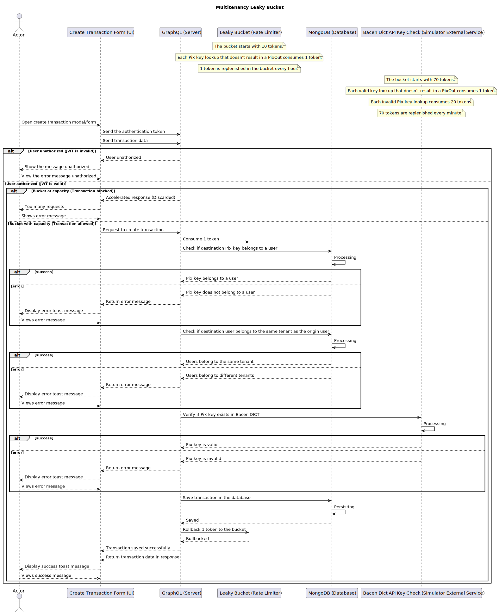

### Overview

Woovi Bank is an inspired project to challenge required for the position Mid-level Fullstack Developer at Woovi, which makes the transfer between two users possible.
The project follows the functional paradigm inspired by the Tao of React and the Tao of Node.js.

To access the production environment you can click in follow link below:
- [Woovi Bank Server](https://woovi-bank-server.hallexcosta.com)
- [Woovi Bank UI](https://woovi-bank-ui.hallexcosta.com)
- Woovi Leaky Bucket Server (Only on localhost for now)
- Woovi Leaky Bucket UI (Only on localhost for now)

### Stacks
**Backend:** Koa.js, MongoDB, GraphQL  
**Frontend:** Vite, Relay, Shadcn/ui  
**Tests:** Vitest, Memory Mongo DB  
**Infra:** Railway, TurboRepo

### Challengers
- [x] Woovi Crud GraphQL Relay
- [x] Woovi Leaky Bucket

**Example to running Server and UI**

You need some requirements
- MongoDB
- Redis

**Start MongoDB & Redis Instances**
```sh
$ docker compose up -d
```

**Configure envs**
```sh
$ pnpm copy:env
```

**Start graphql server**
```sh
$ cd apps/bank-server && pnpm dev
```
> Access the ui: http://localhost:3333/graphql

**Start UI server**
```sh
$ cd apps/bank-ui && pnpm relay && pnpm dev
```
Access the ui: http://localhost:5173  
 
>Follow the same steps to up the `multi-tenancy-leaky-bucket-server` and `multi-tenancy-leaky-bucket-ui`  
>
>By default `multi-tenancy-leaky-bucket-server` and `bank-server` run on the default port 3333 so run one at a time, and the same goes for `multi-tenancy-leaky-bucket-ui` and `bank-ui`  

### Sequence Diagrams

**Multitenancy Leaky Bucket Diagram Sequence**


In other langs:
- [pt-BR](./docs/diagrams/pt-BR/multitenancy-leaky-bucket-sequence-diagram.svg)


**Bank CRUD Diagram Sequence**  
Soon coming

### Common erros
Íf you try run the relay and it throw an error relation to watchman, you can try install using brew command  

> Watchman error: The watchman server reported an error: "A non-recoverable condition has triggered. Watchman needs your help! The triggering condition was
```sh
$ brew install watchman
```
https://facebook.github.io/watchman/docs/troubleshooting#poison-inotify_add_watch
