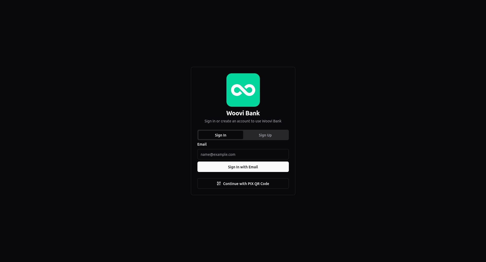
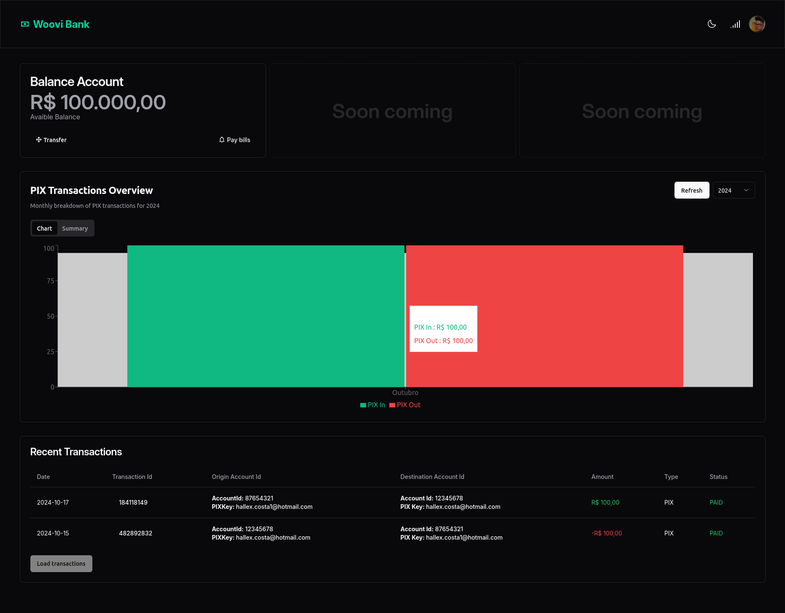

## Overview

Woovi Bank UI. Practices inspired in [Tao of React.js](https://alexkondov.com/tao-of-react) philosofy with a functional programming.

To access the production version you can click in below links:  
[Bank Server](https://woovi-bank-server.hallexcosta.com/graphql)  
[Bank UI](https://woovi-bank-ui.hallexcosta.com)  

Default accounts for Login (Passwordless):
- hallex.costa@hotmail.com
- hallex.costa1@hotmail.com

#### Techs
- [x] [Node.js](https://nodejs.org/en)
- [x] [Typescript](https://www.typescriptlang.org)
- [x] [Vite.js](https://vite.dev)
- [x] [Railway](https://railway.app)
- [x] [v0](https://v0.dev)

#### Frameworks and Libs
- [x] [React.js](https://react.dev/)
- [x] [Vitest](https://vitest.dev/)
- [x] [shadcn/ui](https://ui.shadcn.com/)
- [x] [Relay](https://relay.dev/)

### Features
- You can create a new account
- You can sign in platform
- You can make transaction for a user that has created an account 
- You can view your transactions
- You can view tou total balance account
- Idempotency applied when create new transactions

### Deliveries
**Frontend**
- [x] It must be able to create an account in an easier way, could have default accounts
- [x] It must have an action button to transfer money between accounts
- [x] It must use Shadcn
- [x] It must use Vite with React Router
- [x] It must use Relay

**Frontned Plus**
- [x] Use Shadcn
- [x] Use vite with React Router latest version
- [ ] Create a storybook of your UI components
- [ ] Create a dash such as a real bank
- [x] It has tested with Jest or a Test Runner of choice  

### Getting Started

1) Access the root dir and up the mongodb and redis instances
```sh
docker compose up -d
```

2) You can use `pnpm test` to run tests  

3) Use `pnpm relay` to compile `schema.graphql`
> Make sure the `schema.graphql` file can be found in the `./apps/bank-server/schema/` directory

4) Use `pnpm dev` to run the UI
 
5) To access UI: https://localhost:5173

## Preview

**Dashboard**



### References:
[Crud Bank GraphQL Relay](https://github.com/woovibr/jobs/blob/main/challenges/crud-bank-graphql-relay.md)  
[Relay Docs](https://relay.dev/docs)  
[Relay Workshop](https://github.com/sibelius/relay-workshop)  